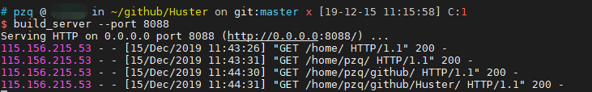
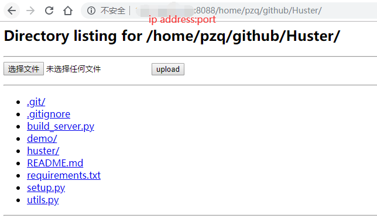

# Huster

HTTP Uploading Server Tool

## Install

You can install it from pip or source code.

1. pip

    ```bash
    pip install huster
    ```

2. source code

    ```bash
    git clone https://github.com/ZQPei/Huster.git
    cd Huster
    python setup.py install # use sudo if necessary
    ```


## Usage

```bash
build_server --port [port=8000] --base_dir [base_dir="/"]
```

or

```bash
python -m huster.server --port [port=8000] --base_dir [base_dir="/"]
```


## Example
If you have built a server on your machine, you can assess it by browsing `http://xxx.xxx.xxx.xxx:8000`. 

It provide a button to upload file from local to server.






